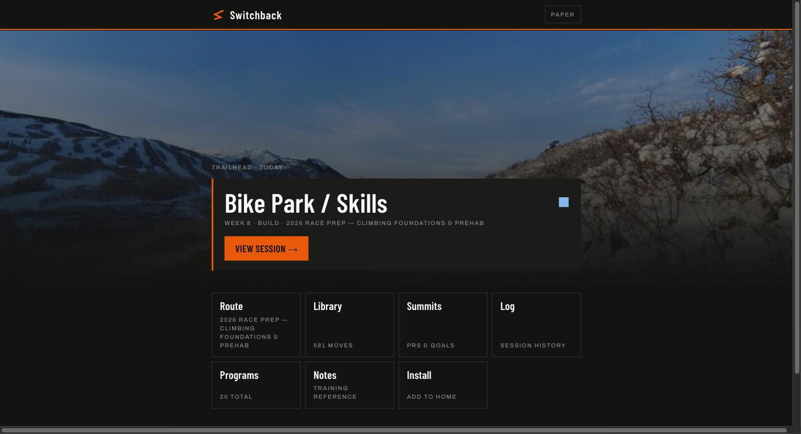
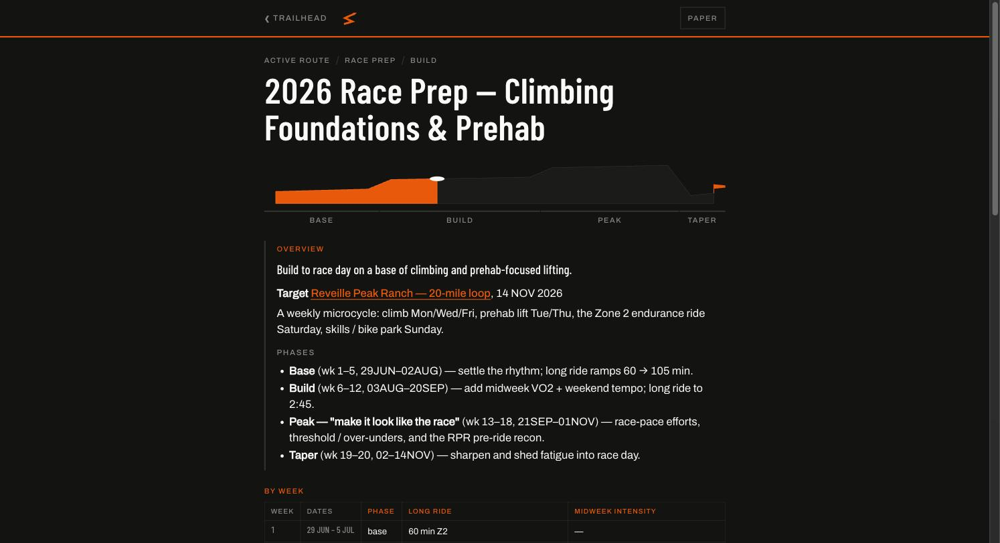
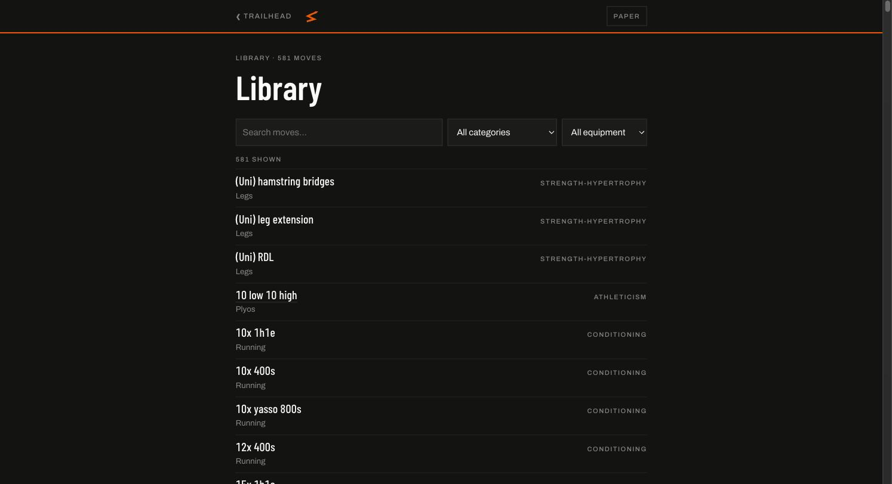

# Switchback

*A strength-training app. Programs are authored in git; logged sets sync to SQLite.*

Named for how you climb terrain too steep to take head-on — obliquely, in structured legs, each one setting up the next. Which is what a training plan is.

The organizing principle: **every kind of data lives in the substrate that matches how it changes.** Training programs are documents — they get revised deliberately, and each revision has a reason worth keeping. Logged sets are events — they arrive constantly, in order, and are never edited in bulk. So programs live in git as plain text, and sets live in SQLite. Neither substrate pretends to be the other.

<p align="center">
  
</p>

---

## Two write doors, two keys

| | Programs, blocks, exercise library | Logged sets |
| :--- | :--- | :--- |
| Substrate | Markdown + YAML in this repo | Cloudflare D1 (SQLite) |
| Written by | Git commits — no in-app editor, for anyone | The logging client, buffered in IndexedDB |
| Read by | Everyone; parsed at build time | Everyone (public by default) |
| Authenticated | GitHub credentials | Passkey per device (WebAuthn) |

There is no in-app path to edit a program, including for the owner. A change to the plan is a commit, which means every revision carries its "why" in the history instead of becoming `program_v3_FINAL`.

Deviations inside a session — a substitution, a cut set, a note — are *log* data, not program edits. Plan and actual stay separate and separately queryable.

Guests get the full product with no account: sets they log stay in their own browser's IndexedDB, never sync, and the UI keeps a persistent "local only" badge up. That path doubles as the public demo.

---

## The route

A program renders as an elevation profile. Deload weeks dip, build phases climb, test day is the summit — the shape of the block is legible before you read a word of it.

<p align="center">
  
</p>

---

## The library

581 moves — `exercises.yaml` (536) merged with `skills.yaml` (78 snowboard and hockey entries) and deduplicated by id. Tagged by category and equipment, searchable instantly.

<p align="center">
  
</p>

Programs and blocks reference moves *by name*. The resolver maps name → id → page at build time, so a prescription is always one tap from how to perform it — and any name that fails to resolve is reported rather than silently dropped.

---

## Content model

```
exercises.yaml      atoms — the exercise library, tagged by category and equipment
skills.yaml         sport-specific atoms, merged into the same catalog
blocks/             molecules — reusable chunks that programs compose (14)
programs/           compositions — one Markdown file per program (20: 5 current, 15 archived)
log/                logged history and the D1 schema
```

- **Exercise identity** is the `id` slug. Names are the reference; ids are the identity.
- **Programs** carry YAML front matter (`id`, `title`, `status`). Exactly one program is `status: active`. Versioning is git history.
- **Blocks** are either literal prescriptions or menus — "pick 1–2 from …" — that resolve against the library. `ROTATOR CUFF WORK` in a program table is a block reference.

Everything is parsed at build time; there is no content database. Build health, including every unresolved name the pipeline collected, is exposed at `/api/health`.

---

## Logging and sync

Sets are written to IndexedDB first and flushed to D1 in the background, so logging works with no signal in a gym basement and reconciles later. The buffer is append-only and ULID-keyed, and there is exactly one writer per account — which is what lets the sync path skip conflict resolution entirely rather than inventing a merge policy it can't test.

The flush is safe to call concurrently: a caller arriving during an in-flight flush awaits that flush instead of no-op'ing, and the loop drains the buffer as read at entry. Devices are disposable; D1 is canonical, so any authenticated browser sees the same history.

Authentication is WebAuthn passkeys, one per device. Server routes are the only thing that can mutate D1; unauthenticated writes get a 401.

---

## Running it

```bash
npm install
npm run dev        # local dev server
npm run build      # prerender all routes; fails on unresolved content
npm run preview    # serve the production build
npm test           # content pipeline, date resolution, set parsing — 43 tests
npm run check      # svelte-check
```

Stack: SvelteKit 2 + Svelte 5 on Cloudflare Pages, D1 for logs, WebAuthn via `@simplewebauthn`. Deployment steps are in [DEPLOY.md](DEPLOY.md); the visual language is in [DESIGN.md](DESIGN.md); the tag vocabulary is in [TAXONOMY.md](TAXONOMY.md).

The interface has a dark mode and a paper mode — the toggle in the header. Paper is for reading a plan; dark is for using one in a gym.

---

## Authoring a program

Point an agent at the repo:

> Draft a `<goal>` block, constraints `<schedule>`, drawing only from `exercises.yaml` and `blocks/`, following the conventions in `programs/`.

Review the diff, commit. The guardrails are in the build: an unresolved move name fails the prerender, so a program that references something the library doesn't have never ships.

---

## License

MIT.
